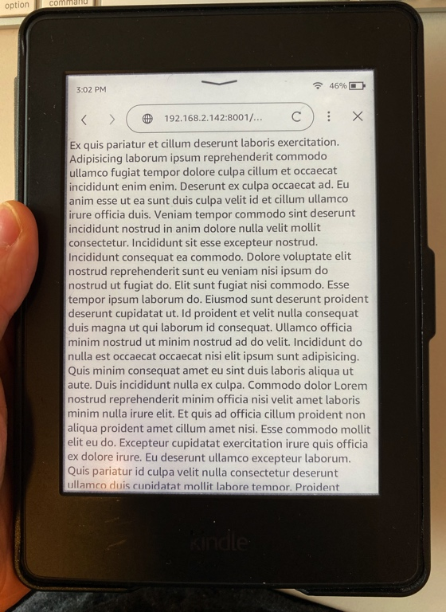

## Introduction

**The web browser on my 2015 Kindle Paperwhite seems like an absolute afterthought**. It mostly just doesn't work for the web of today, and I doubt it ever has for the web of yesterday either.

Not only was it already old on the day it was released (based on code [[#^b04b86|from 2009]]), even many _old_ standard browser features are unsupported or badly supported.

On the few pages where it does _not_ fully break (like Wikipedia), the user experience remains terrible:

- It loads **pages slowly**. Too much media content or JS may freeze the browser.
- Nearly every site appears as a **tiny, zoomed-out** desktop site on its 6-inch screen. This is because the browser reports a viewport width equal to its actual pixel width (1072 pixels), an oddity compared to the high-res smartphones & tablets of the last decade.
- It is not possible to increase the font size of a page...
- ... so one invariably has to muck around with **fickle zooming-and-panning** to read any text.

From a web developer's perspective, the situation is equally abysmal. I couldn't find any documentation on the browser from Amazon (or from anywhere, for that matter). If you want your site to work on the Kindle, you're on your own.

These reasons are probably why virtually nobody seems to care about this browser, or has cared about this browser, except some quirky developers like me, who played with it for their own projects.

And yet, the browser has potential! However bad it is, it gives the Kindle a view onto the interactive open web. Sure, you can use _Send to Kindle_ and enjoy web articles this way, but the web is more than just static information. **What if we could design & build a web _app_, _specifically_ for the Kindle browser?**

The Kindle, even old ones, also has great assets that remain relevant today:

- A nice, high-resolution e-ink display.
- A WiFi connection.
- A pretty workable virtual keyboard.

This is what I set out to do with **[Readup.ink](https://github.com/th0rgall/readup-kindle)**: to port the [Readup reading platform](https://readup.org) to the Kindle web browser. I'm happy with how it turned out! My Kindle now works as a perfectly serviceable social web reader.

I can imagine more fun uses:

- a web client for an RSS feed reader? [FreshRSS](https://www.freshrss.org/), perhaps? **Update: [I have built this now](https://codeberg.org/thor/kindle-rss)**.
- a simple Mastodon web client for Kindle?
- ...

I hope this note helps people on their way to build such cool web apps for the Kindle (or other common e-ink devices).

## Tested on a Kindle Paperwhite 3

Everything here should be prefaced with the observation that I tested the browser on my Kindle device, which is a **Kindle Paperwhite 3 (7th generation) from 2015.** ([Wikipedia](<https://en.wikipedia.org/wiki/Amazon_Kindle#Kindle_Paperwhite_(third_iteration)>)). It is, admittedly, old.

At the moment of writing, it is running the "Firmware Version" 5.16.2.1.1 (40974470002)

Relatively recently, it got an update with a UI overhaul. This update also dropped the word "Experimental" from the name "Experimental Web Browser". It still remains very experimental, as you can read here.

YMMV. If your have different information about older or newer Kindles, let me know! I'll try to keep this up-to-date.

## About the Kindle WebKit Browser

^b04b86

- The Kindle browser is based on Apple's WebKit.
- It's user agent varies, depending on where you check:
  - The HTTP `User-Agent` header reports:
    ```
    Mozilla/5.0 (X11; U; Linux armv7l like Android; en-us) AppleWebKit/531.2 (KHTML, like Gecko) Version/5.0 Safari/533.2 Kindle/3.0
    ```
  - `navigator.userAgent` reports:
    ```
    Mozilla/5.0 (X11;; u: Linux armv7l; en-us) AppleWebKit/534.26 (KHTML, like Gecko) Version/5.0 Safari/534.26
    ```
- The above suggests a WebKit version in the range of 531.2 - 534.26.
- This corresponds to WebKit versions used in **Safari 4**, released for Mac OS X Tiger in **the summer of 2009** ([Wikipedia](https://en.wikipedia.org/wiki/Safari_version_history#Safari_4)), and maybe **Safari 5** too ([mdn browser compat](https://github.com/mdn/browser-compat-data/blob/47997fc52cf340d53f05b5829b6839655306acba/browsers/safari.json#L52-L70)). These are useful reference points to look up in MDN/CanIUse "Browser Compatibility" tables, because WebKit versions are generally not mentioned in compatibility tables, but Safari versions are.
- Amazon distributes (parts of?) its Kindle WebKit code in its [open-source disclosure](https://www.amazon.com/gp/help/customer/display.html%3FnodeId%3D200203720). At the time of writing, it reports a webkit version of `webkit-1.0_1.4.2` for my 5.16.2.1.1 Kindle Paperwhite (7th gen).

## Viewport

- The real resolution of my the screen is 1072px x 1448px
- The **reported** browser viewport size is 1072px x 1268px (`documentElement.clientWidth` x `documentElement.clientHeight`)
- But the actually usable screen viewport is **1072px x 1231px**, presumably because of the non-removable browser UI on top.

## Quick tips

### jQuery 3.7 seem to work generally!

I haven't encountered something that it couldn't do, that it was supposed to be able to do [Browser feature support reference](#Browser%20feature%20support%20reference). Even the [`.ajax()` API](https://api.jquery.com/jQuery.ajax) works and is a little less painful than [`XMLHttpRequest`](https://developer.mozilla.org/en-US/docs/Web/API/XMLHttpRequest).

Granted, I am polyfilling the browser in several uses of jQuery.

### Transpilation & polyfilling helps

The JS language support, as well as available DOM methods & properties, is limited (see [Browser feature support reference](#Browser%20feature%20support%20reference) below).

For the former, you can transpile your code to an older ECMAScript version (ES5). For the latter, you can include polyfills. This allows you to write modern JS without checking every language construct.

It might be helpful to take a look at:

- the convoluted transpilation compilation pipeline I've set up for Readup.ink (https://github.com/th0rgall/readup-kindle/blob/main/client-builder.js
- and the polyfills that are included (https://github.com/th0rgall/readup-kindle/blob/main/metafills.js).

It is still important to keep testing your code with every change (and checking the transpilation output), because some things will just not work, or will need more polyfills.

## Important quirks to be aware of

The browser is not just old, it's also limited and weird. Here are some quirks I dealt with.

### The document height is always larger than screen height

I couldn't create a HTML document that was non-scrollable, and had height below the actual viewport height. This is related to the [Viewport](#Viewport) specs above.

`video({ src = "always-present-scrollbar.mp4", loop = true })`

### The scroll bar is (supposed to be!) a permanent _overlay_

This is related to the above document height issue.

- You would expect that setting your document container to `height: 100%; overflow: hidden;` would hide any scrollbar (because there is no content to scroll). But no standard method of hiding the scrollbar works (I've tried).
- You would also expect that your page content can't be displayed under the scrollbar, even if you set `body` margin/padding properties to 0. In the Kindle, this happens.

**I haphazardly found [a hack](https://github.com/th0rgall/kindle-browser-tests/blob/main/tests/scrollbar/hide-scrollbar-overflow-width.html) that was able to remove the scroll bar**: overflowing the width by a few % (`103%`), in a very specific configuration with several nested scroll containers. I suspect this triggers some browser bug. I'm using this hack in Readup.ink to implement page-turn reading without scrolling.



### Text content inside `<a>` links is always underlined

^kindle-links

At least, when their `href` attribute has content.

`text-decoration: none` has no effect here.

In Readup.ink, I [worked around this](https://github.com/th0rgall/readup-kindle/blob/9f99abcb1eb8939593ba00423ea148bb1b327225/static/index.js#L1-L6) using JS by:

1. Adding a `data-href` property on anchors, instead of a `href`.
2. Listening to click events on anchors in JS, and opening their links using `window.open`

### Editing the browser URL

## Browser feature support reference

These are the features I've tested.

### HTML

| Feature | Working? |
| ---- | ---- |
| `<svg>` | ✅ |
| `<meta name="viewport">` | ❌ |

### CSS

| Feature                               | Working? | Comment                          |
| ------------------------------------- | -------- | -------------------------------- |
| flexbox, grid                         | ❌        | use bad old `float` & clearfixes |
| `position: sticky`, `position: fixed` | ❌        | they seem just static            |
| `rem` sizes                           | ✅        |                                  |
| Media queries                         | ✅        | screen width queries tested      |

### JS

Generally, only a subset of features from **ES5** are supported.

Check [this article](https://www.freecodecamp.org/news/es5-to-esnext-heres-every-feature-added-to-javascript-since-2015-d0c255e13c6e/) to get an overview of what newer ES features you can't use _without transpilation_.

I'm highlighting a few notable ES2015 (ES6) features here:

- Promises `new Promise((resolve, reject => {}).then()`
- Template strings & interpolation `\`${}\``
- Arrow functions `() => {}`
- `const`/`let` declarations
- `class` declarations
- default parameters `function(param1 = 'mydefault') {}
- destructuring assignments `const {a, b} = {a: 1, b: 2}`
- `for (... of ...) { }` loops

## DOM

| Feature              | Working? | Comment                                              |
| -------------------- | -------- | ---------------------------------------------------- |
| `fetch` API          | ❌       |                                                      |
| `element.scrollTo()` | ❌       |                                                      |
| `scrollTop = ...`    | ⚠️       | only on non-window/document elements                 |
| window.clientWidth   | ⚠️       | requires `body {width: 100%}` to give a non-0 result |
| `localStorage` API   | ✅       | surprisingly!                                        |

#### DOM Events

Very limited. There is no way to implement a dragging operation, or interact in any meaningful way with the touchscreen beyond "clicks".

Here is what I tried:

✅ **Working as expected**

- `click`
- `mouseout` is interesting: it only triggers on the first click outside an element that was clicked. Not sure if that's the specced behavior.
- `scroll`: it looks like a long drag triggers several `scroll` events.

⚠ **Triggering, but useless**

- `mouse{move, down, up, over}` are essentially all aliases of the `click` event. They get triggered, but only _after_ a single tap.

❌ **Not triggering**

- `mouse{enter, leave}; pointer*; drag*, touch\*; visibilitychange;
- `dblclick` does not trigger an event, but results in a native toggle-able zoom action on an element. It's not possible to `preventDefault()` this.

## Things I tried, but failed to accomplish

- Configuring SvelteKit for Kindle/ES5-compatible code.
- Configuring NextJS for Kindle/ES5-compatible code.
