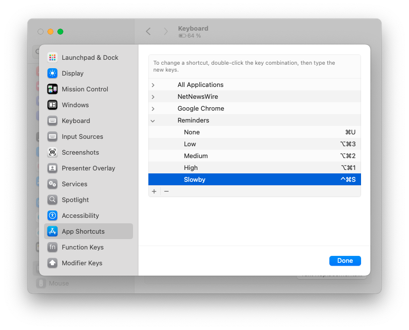

I cleaned up my Apple Reminders setup today in the hope of using it again, but I got frustrated with the lack of keyboard shortcuts for actions I will commonly use.

One missing shortcut is the ability to change the reminder's underlying list when adding a reminder from a time-based view like "Today".

Luckily, I found some workarounds. Here are two approaches.

## 1. Using the context menu via the keyboard

This method unfortunately still requires large number of steps, and is not a single shortcut, but it can be performed in full with the keyboard.

`video({ src = "reminders-change-list-shortcut.mp4" })`

First, make sure a reminder/reminders are selected. While you're in editing mode, you can press `Esc` and then `↓`, for example.

Next, perform these shortcuts.

```
Ctrl+⏎  L  →  →  [type the first letter of your desired list]  ⏎
```

Explanation:
- `Ctrl+⏎` opens the context menu of the selected reminders
- `L` jumps to the "List" entry
- `→` opens the entry
- `→` again opens the "iCloud" lists (you might have different list providers here, too)
- further selection menu with first letter(s) or arrows helps select the right list
- `⏎` confirms the selection and applies the change

## 2. Using app-specific keyboard shortcuts

*Reminders* provides app menu items for each of your lists in Edit > List. This can be leveraged by macOS' default support for [App Shortcuts](https://support.apple.com/guide/mac-help/create-keyboard-shortcuts-for-apps-mchlp2271/mac) to create a single keyboard shortcut for setting a reminder to a specific list. If you want to use this for multiple lists, you will need to create multiple shortcuts.

Here is an example setup. I also set shortcuts for changing the task priority, and unsetting a reminder's deadline, since those were missing as well.


To avoid ambiguity, you should probably follow Apple's docs and specify the menu items like `Edit->List->iCloud->[your list]`, but using the action name alone worked in my case too.

I hope this helps! And I hope Apple will add a way to change the list while typing the reminder title, just like you can by type `#` to select tags.