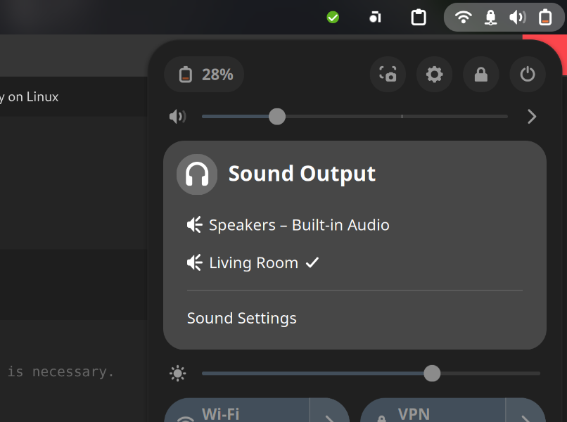

 Surprise: on a recent distribution with Pipewire, **it just works** by adding a single configuration file, and restarting pipewire.

I'm using Bluefin GTS on a Framework 12, which is currently based on Fedora Silverblue 41, including pipewire 1.2.8 (and GNOME Shell 47).

What I had to do to get AirPlay working, was add this configuration file at `~/.config/pipewire/pipewire.conf.d/raop-discover.conf`:

```
context.modules = [
  { name = libpipewire-module-raop-discover
    args = {
      stream.rules = [
        {
          matches = [
            { raop.ip = "~.*" }
          ]
          actions = {
            create-stream = {
              stream.props = {
                media.class = "Audio/Sink"
              }
            }
          }
        }
      ]
    }
  }

```

And then restart pipewire:

```sh
systemctl --user restart pipewire
# ChatGPT also suggested this, but it didn't seem necessary
systemctl --user restart pipewire-pulse
```

Then my HomePod Mini was visible in the Sound output settings of GNOME, under its configured name in Apple Home, "Living Room":



I've tested it for some hours, and have experienced no stability issues.
## Caveats

It's not a perfect solution:
-  This Pipewire module simply forwards all PC output audio to the HomePod. It does not share specific media (for example from a music player app), and it does also not share the metadata (cover art) of currently playing media.
- It does not make media controllable from other devices (for play/pause/...)

I don't urgently need these capabilities, so I didn't look into them, but I hope they are achievable.
## Documentation

- The [Pipewire RAOP (AirPlay) Discovery Module](https://docs.pipewire.org/page_module_raop_discover.html)
- The [Pipewire RAOP (AirPlay)  Sink Module](https://docs.pipewire.org/page_module_raop_sink.html)

I'm grateful to [this 2023 blog post](https://nyllep.wordpress.com/2023/06/04/output-audio-to-apple-homepod-on-linux/) for making me realize which project I needed to try, and to ChatGPT allowing me to lazily figure out how to add configuration to Pipewire.

The search to make this integration work took quite some time, as it did for the author of the the above blog post. It seems that solutions existed for AirPlay v1, but that the current Pipewire module was not stable until even a year ago. Lucky me for only needing this now!

When researching AirPlay on Linux, it's also easy to get led astray with popular projects that only create an *AirPlay receiver/server* on Linux (not a client), for example: [UXPlay](https://github.com/FDH2/UxPlay) and  [Shairport Sync](https://github.com/mikebrady/shairport-sync) are two maintained options for this, but there are plenty of older, unmaintained project (versions) that are better referenced online.
